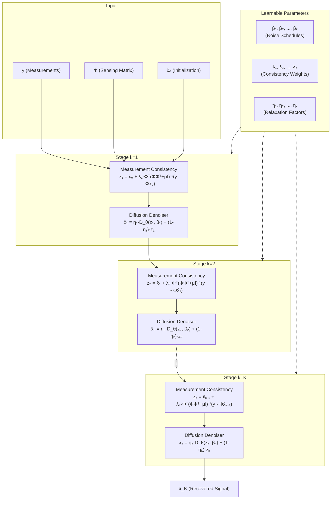

# UDiff Architecture

> Detailed architecture documentation for the Deep Unfolded Diffusion Recovery framework.

---

## System Overview

The UDiff architecture consists of K unrolling stages, each performing two key operations: a measurement consistency step and a diffusion denoising step. The full pipeline is illustrated below.



---

## Denoiser Architecture

### Overview

The diffusion denoiser `D_θ(z, β)` is a conditional neural network that estimates the clean signal from a noisy input at a specified noise level. It follows the architecture of a score-based diffusion model but is specifically designed for the unfolding framework.

### Network Design

```
Input: z ∈ ℝⁿ (noisy estimate), β ∈ ℝ (noise level)
                    │
                    ▼
        ┌───────────────────────┐
        │   Noise Embedding     │
        │   β → MLP → γ ∈ ℝᵈ  │
        └───────────┬───────────┘
                    │
                    ▼
        ┌───────────────────────┐
        │   Input Projection    │
        │   z → Linear → h₀    │
        └───────────┬───────────┘
                    │
                    ▼
        ┌───────────────────────┐
        │   Residual Blocks     │
        │   × L layers          │
        │                       │
        │   hₗ = hₗ₋₁ +        │
        │     MLP(hₗ₋₁ ⊙ γ)   │
        │   + LayerNorm         │
        └───────────┬───────────┘
                    │
                    ▼
        ┌───────────────────────┐
        │   Output Projection   │
        │   hₗ → Linear → x̂   │
        └───────────────────────┘

Output: x̂ ∈ ℝⁿ (denoised estimate)
```

**Key design choices:**
- **Noise conditioning**: The noise level β is embedded via a sinusoidal positional encoding followed by a 2-layer MLP, producing a modulation vector γ that scales intermediate features.
- **Residual blocks**: Each block consists of two linear layers with GELU activation, layer normalization, and a skip connection.
- **Weight sharing**: The denoiser weights θ are shared across all K stages. Only the noise level β_k varies per stage, allowing the same network to denoise at different levels.
- **1D architecture**: For sparse signal recovery, the denoiser operates on 1D vectors. For MRI, a U-Net variant with 2D convolutions is used.

### For 2D MRI Reconstruction

The denoiser for MRI uses a U-Net architecture:

| Component | Details |
|-----------|---------|
| Encoder | 4 downsampling blocks, channels: 64 → 128 → 256 → 512 |
| Bottleneck | 2 residual blocks at 512 channels |
| Decoder | 4 upsampling blocks with skip connections |
| Normalization | Group normalization (8 groups) |
| Activation | SiLU (Swish) |
| Noise conditioning | Timestep embedding via FiLM modulation |

---

## Measurement Consistency Step

### Mathematical Formulation

At each stage k, the measurement consistency step computes:

```
z_k = x̂_{k-1} + λ_k · Φᵀ(ΦΦᵀ + μI)⁻¹(y - Φx̂_{k-1})
```

where:
- `x̂_{k-1}` is the estimate from the previous stage
- `Φ ∈ ℝᵐˣⁿ` is the sensing/measurement matrix
- `y ∈ ℝᵐ` is the measurement vector
- `λ_k` is the learnable consistency weight for stage k
- `μ > 0` is a regularization parameter

### Sherman–Morrison–Woodbury (SMW) Identity

The key computational challenge is computing `Φᵀ(ΦΦᵀ + μI)⁻¹`. When `m < n` (compressed sensing regime), direct computation in the measurement domain is more efficient:

```
Φᵀ(ΦΦᵀ + μI)⁻¹ = (1/μ)[Φᵀ - Φᵀ(ΦΦᵀ + μI)⁻¹ΦΦᵀ]
```

**Equivalently**, using the matrix inversion lemma:

```
(ΦᵀΦ + μI)⁻¹Φᵀ = Φᵀ(ΦΦᵀ + μI)⁻¹
```

This allows precomputation of `(ΦΦᵀ + μI)⁻¹` as a single `m × m` matrix inversion (where `m ≪ n`), which can be cached and reused across all stages and samples.

### Implementation Notes

1. **Precomputation**: `(ΦΦᵀ + μI)⁻¹` is computed once at initialization using Cholesky decomposition.
2. **Batched operations**: The consistency step is vectorized across the batch dimension.
3. **Gradient flow**: The consistency step is fully differentiable, enabling end-to-end gradient propagation through λ_k.

---

## Learnable Parameter Schedule

### Per-Stage Parameters

Each of the K unrolling stages has three learnable scalar parameters:

| Parameter | Symbol | Role | Initialization | Constraints |
|-----------|--------|------|-----------------|-------------|
| Noise level | β_k | Controls denoiser strength | Linear decay: β_k = 1 - k/K | β_k ∈ (0, 1), monotonically decreasing preferred |
| Consistency weight | λ_k | Balances data fidelity vs. prior | λ_k = 1.0 for all k | λ_k > 0 (softplus parameterization) |
| Relaxation factor | η_k | Interpolation between denoiser output and input | η_k = 0.5 for all k | η_k ∈ (0, 1) (sigmoid parameterization) |

### Parameterization Details

To enforce valid ranges during unconstrained optimization:

- **β_k**: Parameterized as `β_k = sigmoid(β̃_k)` where `β̃_k` is the unconstrained learnable parameter.
- **λ_k**: Parameterized as `λ_k = softplus(λ̃_k)` to ensure positivity.
- **η_k**: Parameterized as `η_k = sigmoid(η̃_k)` to constrain to (0, 1).

### Learned Schedule Behavior

After training, the learned parameters typically exhibit:
- **β_k**: Monotonically decreasing — early stages perform coarse denoising (high noise level), later stages perform fine refinement.
- **λ_k**: Generally increasing — later stages emphasize measurement consistency more strongly.
- **η_k**: Moderate values (0.3–0.7) — balancing denoiser confidence with input fidelity.

---

## Data Flow

### Forward Pass (Training)

```
1. Generate/load batch of sparse signals x ∈ ℝⁿ
2. Compute measurements y = Φx + noise
3. Initialize x̂₀ = Φᵀy (matched filter / backprojection)
4. For k = 1, ..., K:
   a. Consistency: z_k = x̂_{k-1} + λ_k · Φᵀ(ΦΦᵀ + μI)⁻¹(y - Φx̂_{k-1})
   b. Denoise:     x̂_k = η_k · D_θ(z_k, β_k) + (1 - η_k) · z_k
   c. Record x̂_k for deep supervision loss
5. Compute total loss: L = Σ_{k=1}^{K} w_k · ||x̂_k - x||²₂
```

### Deep Supervision Weights

The loss weights `w_k` give higher importance to later stages:

```
w_k = k / (K(K+1)/2)
```

This ensures the final output receives the strongest supervision signal while still guiding intermediate reconstructions.

### Inference

At inference time, only the final output `x̂_K` is used. The forward pass is identical but without loss computation or gradient tracking.

---

## Computational Complexity

| Operation | Per-Stage Cost | Notes |
|-----------|---------------|-------|
| Consistency step | O(mn) | Matrix-vector products; `(ΦΦᵀ+μI)⁻¹` precomputed |
| Denoiser forward | O(nL) | L = number of layers; n = signal dimension |
| Total (K stages) | O(K(mn + nL)) | K = 8 in default configuration |

**Comparison**: Standard diffusion sampling requires T = 1000 reverse steps, each with a full network forward pass. UDiff requires only K = 8 stages, yielding ~125× speedup.
